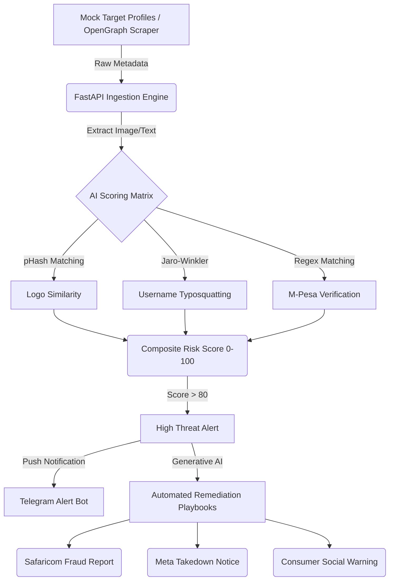

<div align="center">
  

  
</div>

<p align="center">
  <a href="https://fastapi.tiangolo.com"></a>
  <a href="https://nextjs.org/"></a>
  <a href="https://supabase.com/"></a>
  <a href="https://www.python.org/"></a>
  <a href="https://tailwindcss.com/"></a>
</p>

---

## 🚨 The Problem: The "Send to Till" Scam
In Kenya, social commerce is exploding, but so is impersonation fraud. Scammers clone legitimate Instagram and Facebook storefronts, steal their product photos, and funnel desperate customers into paying fraudulent M-Pesa Till numbers. The authentic brands lose their reputation, and customers lose their hard-earned money.

## 🛡️ The Solution: Halisi
**Halisi** *(Swahili for Authentic/Real)* is a multi-modal AI detection engine built to automatically discover, score, and remediate brand impersonation across Kenyan social commerce. We bridge the gap between AI threat detection and actual financial/legal takedown workflows.

<br>

<div align="center">
  
  <h3>5-Dimensional Risk Scoring</h3>
</div>

Instead of just looking at the account name, Halisi's AI Engine computes a holistic `0-100` threat score using five concurrent modules:
1. **Logo Perceptual Hashing:** Compares the target's avatar against the merchant's registered logo using pHash/dHash (`imagehash`).
2. **Handle Typosquatting:** Evaluates Jaro-Winkler string distance (`rapidfuzz`) to catch sneaky username shifts (e.g., `nairobi_shoes` vs `nairobl_shoes`).
3. **M-Pesa Till Verification:** Checks if the requested payment Till matches the merchant's official Safaricom records.
4. **Bio Keyword Analysis:** Flags suspicious Kenyan scam tokens ("Pay before delivery", "Delivery countrywide").
5. **Creation Date Discrepancy:** Flags brand new accounts pretending to be established 5-year-old brands.

---

## 🏗️ Architecture & Data Flow



---

## 🚀 Key Features
* 🔍 **Public Link Checker:** Consumers can paste an Instagram/Facebook link and instantly get a Trust/Danger badge before sending any money.
* 📊 **Merchant Dashboard:** A centralized radar for brands to track who is impersonating them in real-time.
* 📝 **AI Playbook Generation:** Automatically drafts official Meta Copyright Takedown notices and Safaricom Fraud Escalation reports, ready to send with one click.
* 🔔 **Instant Alerts:** Pushes critical threat alerts directly to the merchant's Telegram or via Africa's Talking SMS.

---

## 💻 Tech Stack Highlights
- **Frontend:** Next.js 14, Tailwind CSS, shadcn/ui, Recharts
- **Backend Core:** FastAPI, Pydantic, Celery (Async Tasks)
- **AI Engine:** CLIP ViT-B-32 (Nvidia Brev GPUs), RapidFuzz, ImageHash
- **Database:** Supabase PostgreSQL
- **Integrations:** Telegram Bot API, Africa's Talking Sandbox, Playwright

---

## 🛠️ Quick Start (Developer Setup)

1. **Clone the Repository**
   ```bash
   git clone https://github.com/chiromo-tech-club/halisi.git
   cd halisi
   ```

2. **Backend Setup**
   ```bash
   cd backend
   python -m venv venv
   source venv/bin/activate  # On Windows: venv\Scripts\activate
   pip install -r requirements.txt
   ```

3. **Start the FastAPI Server**
   ```bash
   uvicorn app.main:app --reload
   ```

4. **Frontend Setup** *(Coming Soon)*
   ```bash
   cd frontend
   npm install
   npm run dev
   ```

---

## 👥 The Team
Built with ❤️ by the **Chiromo Tech Club (University of Nairobi)** for the Hackathon:
* **Collins Kimanzi** - Lead Architect, AI Pipeline & UI/UX
* **Geoffrey** - Ingestion Pipelines & External Integrations
* **Ndegwa** - Frontend Application & Design System
* **Dennis** - Full-Stack QA & Cross-module Integration

<p align="center">
  
</p>
