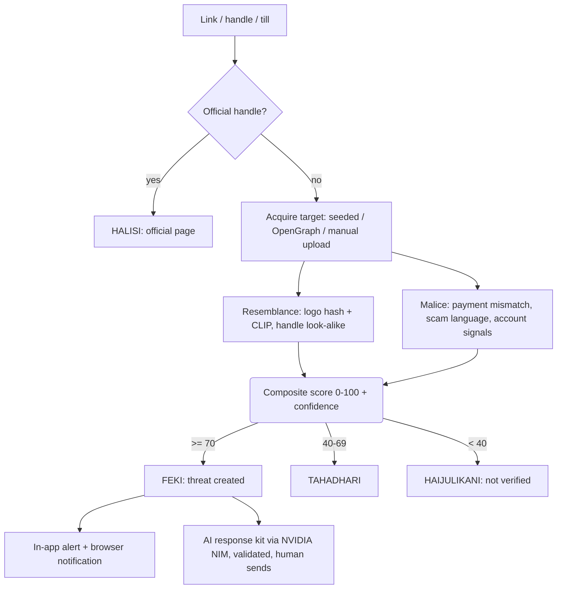

<div align="center">
  

  
</div>

<p align="center">
  <a href="https://fastapi.tiangolo.com"></a>
  <a href="https://nextjs.org/"></a>
  <a href="https://supabase.com/"></a>
  <a href="https://www.python.org/"></a>
  <a href="https://tailwindcss.com/"></a>
  <a href="https://www.nvidia.com/en-us/"></a>
</p>

---

## 🚨 The Problem: The Clone-and-Collect Scam
In Kenya, social commerce runs on Instagram, Facebook, TikTok and WhatsApp, and payments run on M-Pesa. Scammers clone a trusted shop's page in minutes: they copy the logo and product photos, pick a look-alike handle (`nairobi_sneakervault_official_ke`), and ask customers to pay a personal number or a Pochi la Biashara. The customer loses money. The real business loses its reputation.

## 🛡️ The Solution: Halisi
**Halisi** *(Swahili for "authentic")* gives customers a verdict **before they pay**, and gives businesses a response kit **within the first minute** of a clone appearing.

- 🔍 **Check a page**: paste a link and get **HALISI** (official), **FEKI** (impersonator), **TAHADHARI** (caution) or **HAIJULIKANI** (not verified), with plain-language reasons.
- 💳 **Check a till or phone**: is this number registered to a verified business, or reported by other customers?
- 🏅 **Halisi Verified**: a certificate page and QR story sticker merchants post, so customers have one trusted place to confirm the real page and till.
- 📡 **Live merchant alerts**: in-app alerts in the Halisi dashboard (bell, toasts, and opt-in phone/browser notifications) with the evidence attached.
- 📝 **AI-drafted response kit**: customer warnings in **English and Swahili**, Instagram/Facebook impersonation report text, and Safaricom and KE-CIRT/CC report drafts. The kit is grounded in computed evidence and **sent by the merchant**, never auto-filed.

---

## 🧠 How the engine decides

Halisi separates **"who is this imitating?"** from **"how dangerous is it?"**. That's how it avoids flagging honest shops that happen to have similar names.

| Dimension | Weight | Signal |
| :-- | :-: | :-- |
| Visual | 30% | Logo vs avatar: perceptual hashes (pHash/dHash) + CLIP ViT-B-32 embeddings on NVIDIA GPUs |
| Identity | 25% | Handle and name look-alikes: separators, homoglyphs (`l`/`1`, `rn`/`m`), `_official_ke`-style affixes |
| Payment | 25% | Phone numbers, tills, paybills or Pochi requests that aren't registered to the business |
| Language | 10% | Weighted English/Swahili/Sheng scam phrases ("lipa kwanza", "pay before delivery") |
| Account | 10% | New account, low activity, first seen recently |

Missing signals lower the **confidence** instead of being guessed. Score ≥ 70 means impersonation; 40–69 means suspicious. Halisi never tells a user a page is "safe".


```mermaid
graph TD
    A[Link / handle / till] --> B{Official handle?}
    B -- yes --> V[HALISI: official page]
    B -- no --> C[Acquire target: seeded / OpenGraph / manual upload]
    C --> D[Resemblance: logo hash + CLIP, handle look-alike]
    C --> E[Malice: payment mismatch, scam language, account signals]
    D --> F(Composite score 0-100 + confidence)
    E --> F
    F -->|>= 70| G[FEKI: threat created]
    F -->|40-69| H[TAHADHARI]
    F -->|< 40| I[HAIJULIKANI: not verified]
    G --> J[In-app alert + browser notification]
    G --> K[AI response kit via NVIDIA NIM, validated, human sends]
```

---

## 💻 Tech Stack
- **Frontend:** Next.js (App Router), TypeScript, Tailwind CSS v4, shadcn/ui, Motion + GSAP
- **Backend:** FastAPI, Pydantic v2, HTTPX
- **AI engine:** CLIP ViT-B-32 on **NVIDIA Brev** GPUs, imagehash, RapidFuzz; remediation LLM via **NVIDIA NIM** (Llama 3.1)
- **Data:** Supabase Postgres + pgvector
- **Alerts:** in-app (polling + service-worker notifications), no third-party messaging

---

## 📚 Documentation
| Doc | For |
| :-- | :-- |
| [AGENTS.md](AGENTS.md) | Tasks, owners, change log, review findings (start here) |
| [docs/BACKEND.md](docs/BACKEND.md) | API contract, engine maths, security |
| [docs/FRONTEND.md](docs/FRONTEND.md) | Design system, pages, motion |
| [docs/BREV_ENGINE_SETUP.md](docs/BREV_ENGINE_SETUP.md) | GPU deployment + demo-day failover |
| [docs/DEVELOPMENT.md](docs/DEVELOPMENT.md) | Local setup, build order, demo script |

---

## 🛠️ Quick Start

```bash
git clone https://github.com/chiromo-tech-club/halisi.git
cd halisi/backend
uv venv --python 3.12 && source .venv/bin/activate   # Windows: .venv\Scripts\Activate.ps1
uv pip install -r requirements.txt -r requirements-dev.txt
cp .env.example .env                                  # DEMO_MODE=true runs fully offline
uvicorn app.main:app --reload --port 8080             # http://localhost:8080/docs
```

Frontend *(coming soon, TSK-005)*:
```bash
cd frontend && npm install && npm run dev             # http://localhost:3000
```

---

## 👥 The Team
Built by the **Chiromo Tech Club (University of Nairobi)**:
* **Collins Kimanzi**: Lead, Detection Engine, AI Remediation & Design Direction
* **Geoffrey**: Backend API, Data, Ingestion & Alerts
* **Ndegwa**: Frontend Application & Experience

With thanks to **Dennis Kuria** for early architecture work.

<p align="center">
  
</p>
